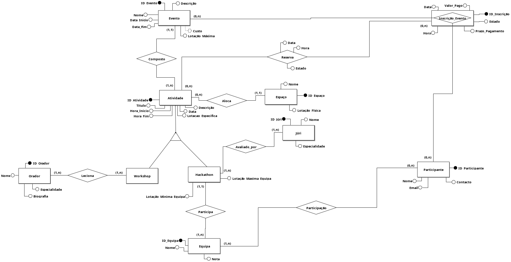
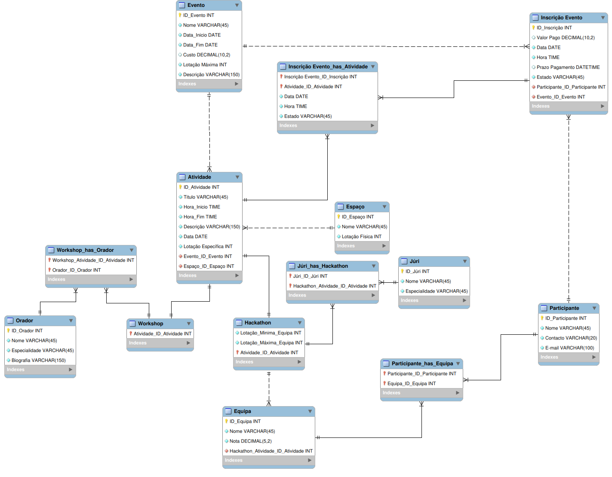

# Event Management Database

Relational database system developed as an academic project for the Databases course at the University of Minho.

## Overview

The project models and implements a database for managing technological events, including participants, registrations, activities, venues, speakers, juries, workshops, hackathons and teams.

The work covered the main stages of database development, from requirements analysis and conceptual modelling to logical design, normalization and physical implementation in MySQL.

## Main Features

- Management of events, activities and venues
- Participant registration and event enrolment
- Support for workshops and hackathons
- Management of speakers, juries and teams
- Capacity and registration status control
- Role-based access control
- Views for reporting and data exploration
- Queries for operational and analytical scenarios
- Indexes for performance optimization
- Stored function and stored procedure
- Triggers for enforcing business rules and data consistency

## Technology

- MySQL

## Database Models

### Conceptual Model



### Logical Model



## Project Structure

```text
.
├── diagrams/
│   ├── conceptual-model.png
│   └── logical-model.png
├── SQL/
│   ├── 01-create-database.sql
│   ├── 02-create-tables.sql
│   ├── 03-users.sql
│   ├── 04-insert-data.sql
│   ├── 05-views.sql
│   ├── 06-queries.sql
│   ├── 07-indices.sql
│   ├── 08-procedures.sql
│   └── views-queries.sql
├── .gitignore
└── README.md
```

## Running the Project

### Requirements

- MySQL 8.0 or later
- A MySQL client, such as MySQL Workbench or the MySQL command-line client

### Execution Order

Run the SQL scripts in the following order:

```text
01-create-database.sql
02-create-tables.sql
03-users.sql
04-insert-data.sql
05-views.sql
06-queries.sql
07-indices.sql
08-procedures.sql
```

Using the MySQL command-line client:

```bash
mysql -u root -p < SQL/01-create-database.sql
mysql -u root -p < SQL/02-create-tables.sql
mysql -u root -p < SQL/03-users.sql
mysql -u root -p < SQL/04-insert-data.sql
mysql -u root -p < SQL/05-views.sql
mysql -u root -p < SQL/06-queries.sql
mysql -u root -p < SQL/07-indices.sql
mysql -u root -p < SQL/08-procedures.sql
```

The database is created with the name:

```text
nextevents
```

## Implementation Highlights

The implementation includes:

- 14 relational tables with primary keys, foreign keys, uniqueness constraints and validation rules
- A view combining events, activities and venues
- Several operational and analytical SQL queries
- Five indexes designed to improve common searches and joins
- A stored function for calculating confirmed event revenue
- A stored procedure for participant registration and waiting-list management
- Three triggers for enforcing registration and team-related business rules
- Three access roles with different permission levels

## My Contribution

I was primarily responsible for the physical implementation of the database and the SQL development.

## Academic Context

- Course: Databases
- Degree: Computer Science
- University: University of Minho
- Academic year: 2025/2026
- Project grade: 18/20
- Group project
